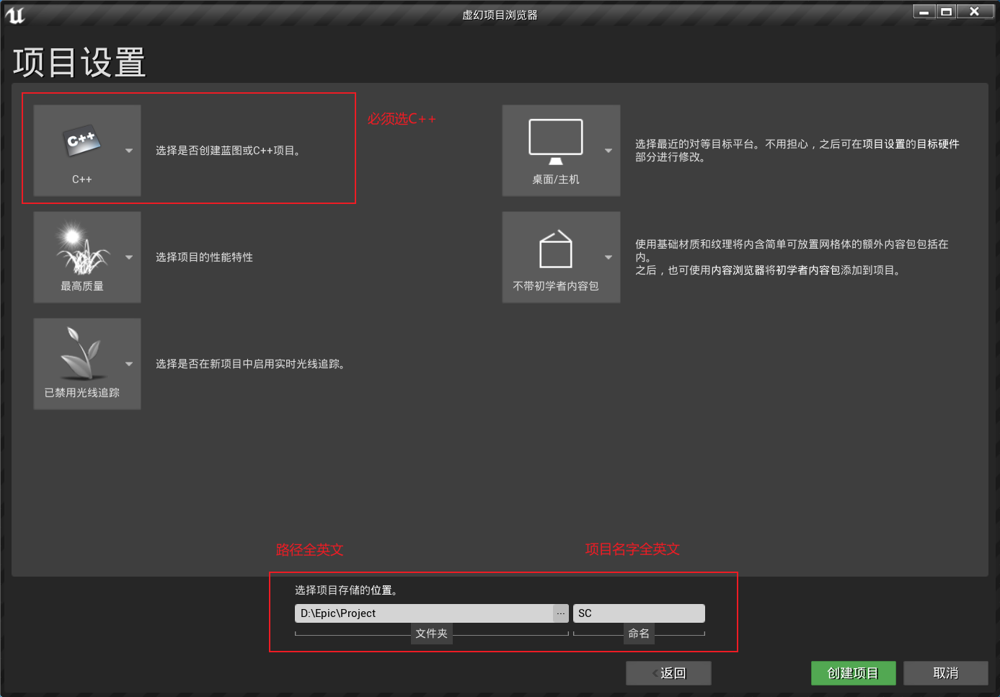
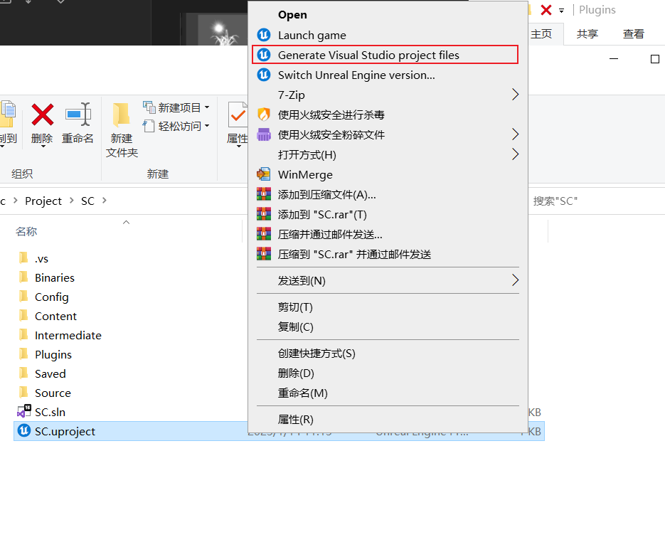
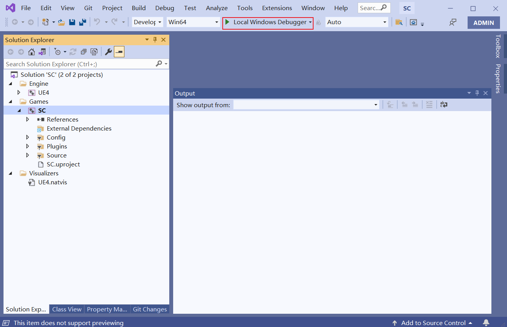
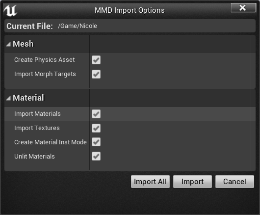
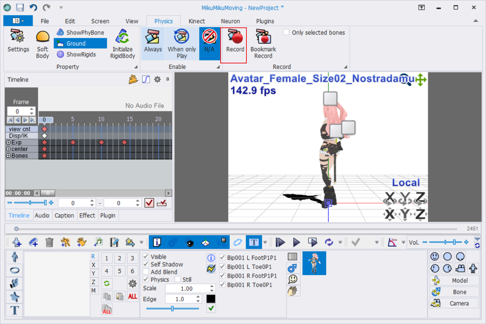
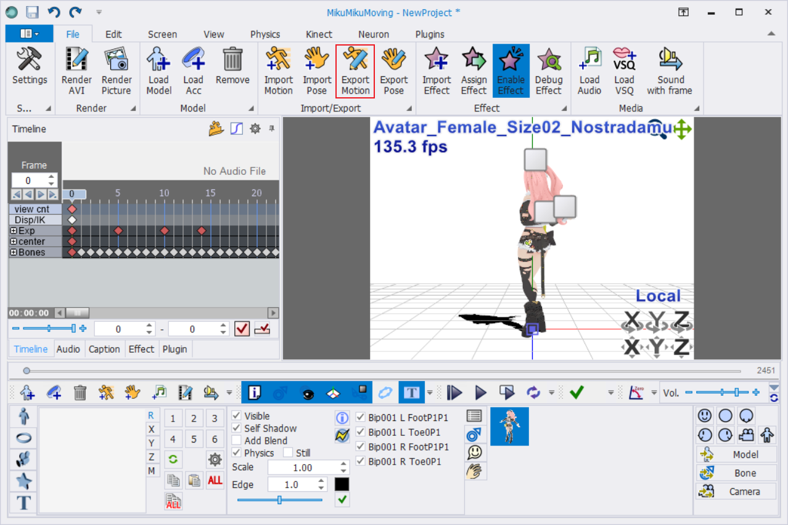
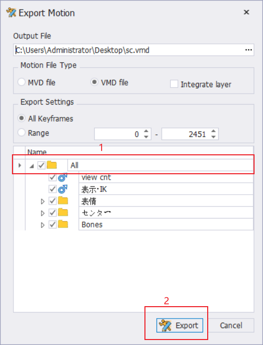
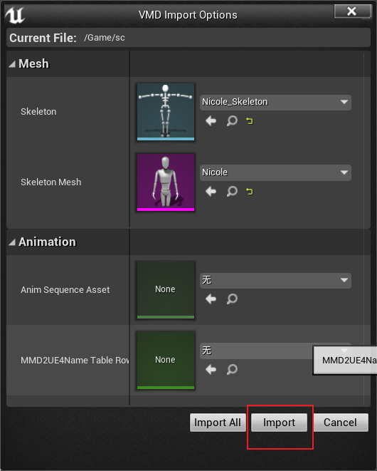

# 来源

之前版本 https://github.com/bm9/UnrealEngine_IM4UPlugin   
4.10.4 、4.16.1 https://github.com/bm9/IM4U  
4.20.1 https://github.com/goopymoon/UnrealEngine_IM4UPlugin/  
4.24.3~5.03 https://github.com/tekifuta/IM4U  

## 克隆存储库

4.24.3 https://github.com/yjlian415/IM4U  
4.25.1 https://github.com/lionelqi/IM4U  
4.25.1 https://github.com/50c1a1-deadc0de/IM4U   
4.26.2 https://github.com/yotaken/IM4U  
4.26.2 https://github.com/TheRoyalDudeness/IM4U    
5.1(不可用) https://github.com/axilesoft/IM-for-UE5  

This software is released under the MIT License

可以直接使用的版本
4.16.1以及之前版本、4.24.3、5.03

需要重新编译的版本
4.20.1、4.25.1、4.26.2、4.27.2

# 使用方法

## 直接使用

把IM4U复制到项目Plugins文件夹中，没有Plugins文件夹就新建一个
文件夹位置\\Plugins

或把IM4U复制到引擎Plugins文件夹中
引擎安装目录\\UE_5.0\\Engine\\Plugins

## 重新编译插件

新建一个C++项目

  

复制IM4U到项目Plugins文件夹中，更新Visual Studio文件

  

打开.sln文件，直接进行编译，完成后自动打开项目 

UE各版本对应的Visual Studio，可通过UEBuildWindows.cs进行查看
安装目录\\UE_4.21\\Engine\\Source\\Programs\\UnrealBuildTool\\Platform\\Windows

## 使用

先导入模型  

使用MikuMikuMoving烘焙物理  

导入动作 

# 关联软件

## 软件

MikuMikuDance https://sites.google.com/view/vpvp/  
PmxEditor https://kkhk22.seesaa.net/category/14045227-1.html  
MME https://w.atwiki.jp/vpvpwiki/pages/219.html  
ray-mmd https://github.com/ray-cast/ray-mmd 

MikuMikuMoving https://sites.google.com/site/mikumikumoving/  

## 插件 
MMDBridge https://mmdbridge.vec4d.xyz/  
MMD4Mecanim http://stereoarts.jp/  
blender_mmd_tools https://github.com/UuuNyaa/blender_mmd_tools  
MMD4Maya https://github.com/gameboy12615/MMD4Maya  
C4D_MMD_Tool https://github.com/MikuMikuDance-tool-for-Cinema-4D-team/C4D_MMD_Tool  

# NPR

## blender

https://github.com/dillongoostudios/goo-engine  
https://github.com/Aoikaze0/Blender_goo_build_windows_x64_vc16_Release  
https://github.com/festivize/Blender-miHoYo-Shaders  
https://github.com/bnpr/Malt  
https://github.com/yuki-koyama/btoon  
https://github.com/kanzwataru/EEVEEToon  
## unity

### 默认3D管线
https://github.com/festivize/PrimoToon  
https://github.com/DeJhon-Huang/FernNPR  

### urp
https://github.com/you-ri/LiliumToonGraph  
https://github.com/unity3d-jp/UnityChanToonShaderVer2_Project  

### hdrp
https://github.com/JasonMa0012/JTRP  

## unreal

### 导入插件

https://github.com/anasrar/Blender-UE4-Workspace  

### 后处理

https://github.com/alwei  
https://github.com/nanpc/UE4-Cartoon-Shader  
https://github.com/SirCodalot/ShadersExample  
https://github.com/shop-0761/tToon  

### 插件

https://github.com/pafuhana1213/KawaiiPhysics  

### 通过插件修改着色器
https://github.com/ruyo/VRM4U  
https://ruyo.github.io/VRM4U/  
https://github.com/Eragon-Brisingr/ToonShader  
https://github.com/Temaran/UE4ShaderPluginDemo  

### 修改渲染管线

https://github.com/kusogaki77/UnrealEngine  
https://github.com/EscapeEntertainmentTeam/UnrealEngine  
https://github.com/envieous/UnrealEngine-SelShader  
https://github.com/Jason-Ma-0012/MooaToon-Engine  
